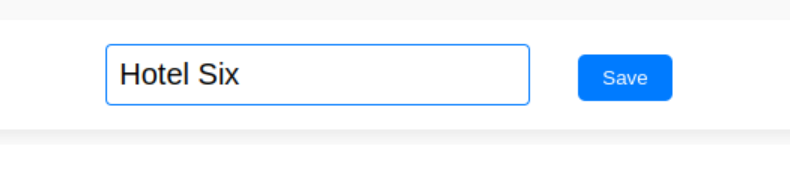
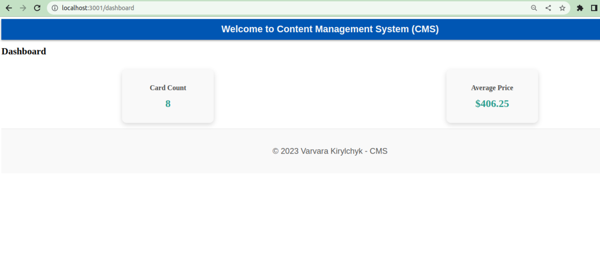

# :bulb: Project

## Content Management System (CMS)

## :rocket: Stack:
- **Frontend**: React.js
- **Backend**: Node.js
- **Database**: MongoDB (same cluster used for project-book-hotel-app)

- npm start -> separately launches frontend and backend

### :sparkles: Description

The system is designed to manage content of the **project-book-hotel-app**.
(Link: https://github.com/Kirylchyk/project-book-hotel-app)

**Offers a user-friendly interface** 
that allows users to manage the content of the booking app. 
Users are able to CRUD:
- create
- read
- update
- delete any card(s).

**Screens**:
- :white_check_mark: Login Page 
- :white_check_mark: Main Page
- :white_check_mark: Dashboard 

**Functions**:
- :white_check_mark: Pagination
- :white_check_mark: Hover-over effects

**Screen: Dashboard**
The screen displays two widgets. Widget "Card Count" calculates 
in backend the total ids of card in db and get the number via get request.
Widget "Average Price" counts average price listed in bd.

**Notes**:
- :construction: Version Control: The system allows users to see previous versions of content (draft)
- :construction: Users with different permissions (draft)
