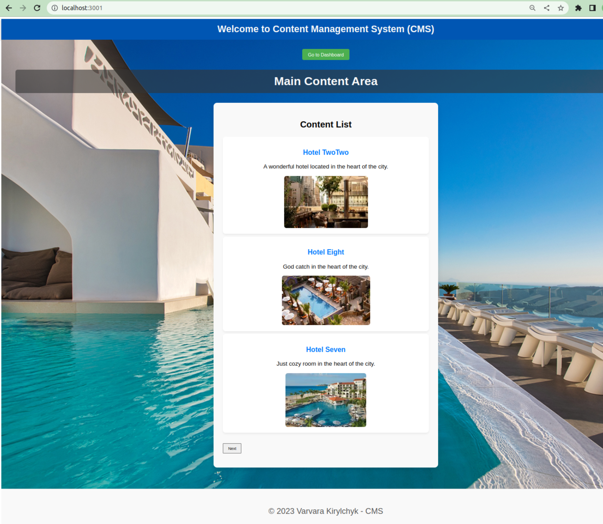

# Project

## Content Management System (CMS)

## Stack:
- **Frontend**: React.js
- **Backend**: Node.js
- **Database**: MongoDB (same cluster used for project-book-hotel-app)

- npm start -> separately launches frontend and backend

### Description

The system is designed to manage content of the **project-book-hotel-app**.

Offers a user-friendly interface 
that allows users to manage the content of the booking app. 
Users are able to create, read, update, and delete (CRUD) accommodation cards.

Screens:
- Login Page 
- Main Page
- Dashboard (overview of the system, including recent updates)

Functions:
-Pagination

Notes:
- Version Control: The system allows users to see previous versions of content (draft)
- Users with different permissions (draft)
